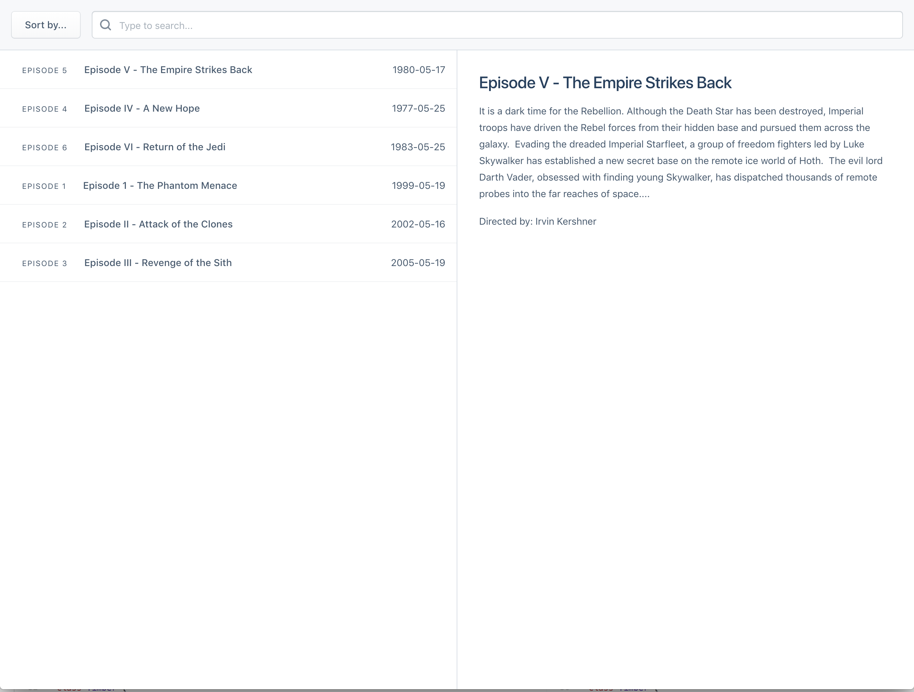
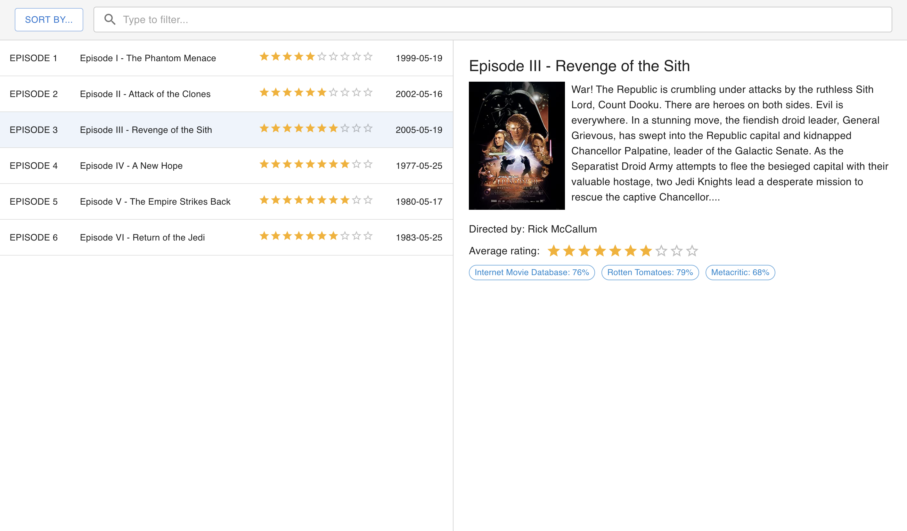

# Test task 1

Live demo - https://webbestmaster.github.io/test-task-1

Repository link - https://github.com/webbestmaster/test-task-1

## Installation

1. install nodejs v18.x (or higher) for your platform
2. go to project's directory
3. run `npm i`

## Dev mode

1. make installation
2. go to project's directory
3. run `npm run start`
4. open http://localhost:9090/

## Description

For developers:

1 - In developer mode, the request to the server is made twice (useEffect is called twice), this is because I use `<StrictMode>`, the link to the documentation is https://legacy.reactjs.org/docs/strict-mode.html. In the assembled project, there is no such problem.

2 - I connected localization to the project because I think that the lines of "human text" in the code are bad practice.

3 - I did not use debounce or throttle, because in our example everything works fine without them, you can check it on the performance tab in chrome dev tool.

4 - I did not connect redux because our project is too small for it.

5 - I wrote tests that check the structure of the server response, I think, for our project it is very important to have the correct response from the server.

6 - Coverage by typescript's types - 100%.

7 - _The last and probably the most important point in this document: my decisions, ideas, implementations, coding style and so on can (and will) differ from the one you use in the team, and, of course, if we work together, then I will write the code in the same way as the team._

In any case, I'm waiting for your opinion. Have a nice day :)

## License

See [license](license).

---

# Requirements

In this assignment you'll create a modern web app to list movies and various information from the Starwars saga. With this app you should be able to see and read about a specific movie as the example image shows below.

To make this possible you need to fetch the data from the following open api endpoint: [`https://swapi.dev/api/films/?format=json`](https://swapi.dev/api/films/?format=json).

As a minimum requirement for this assignment, fulfil all "Assignment criteria" listed below. The bonus feature is not a requirement.

**The images in this assignment are just an example for the layout, your final result should aim to have the same features, and somewhat same layout. But we encourage you to add your own flavour and extra features to showcase your skills.**

### 🛠️ Tooling

We're developing primarily using React, Redux and Jest with Typescript, but you're free to complete this assignment in whichever way you're comfortable with. The only requirement we have is that it should be written in JavaScript or Typescript.

For this assignment, you should create a repository in Git and commit all your changes in it. How you will hand in your code is explained below.

### ✅ Assignment criteria
1. When the app is loaded, a list of the movies should be displayed.

2. When selecting a movie in the list, a detailed view of it should be displayed in the right hand side of the application.

3. When no movie is selected, a default text should be displayed instead.

4. There should be a way to order the movies by at least `Year` or `Episode`. Feel free to add additional order options and functionality as you see fit.

5. There should be a way to filter the movies by entering their name in the text input.

## ⭐️ Bonus feature

As an extra task, you will add ratings and posters for your movies. This data should be fetched from the second endpoint: [`https://www.omdbapi.com/`](https://www.omdbapi.com/). To use this API, you will need an apikey: `b9a5e69d`

### ✅ Bonus feature criteria
1. When a movie is selected, there should be a preview of the poster image and the ratings from Imdb, Rotten Tomatoes and MetaCritics in the detail view.

2. Also an average rating should be calculated from the three ratings and displayed.

3. There should be a way to order the movies by `Ratings` as the select menu shows in the image below.

Please feel free to add any extra features on top of these critera as you like.

## 📥 Handing in the assignment

You can hand in your assignment by creating a repository on GitHub and pushing it there. If you don't have a GitHub account, you can ZIP the repository and send it to us by email.
